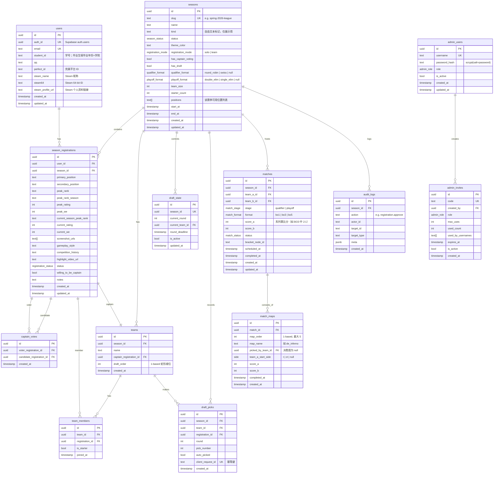

# 数据模型

## ER 图（Mermaid）

---

## 枚举值

### `season.kind`（自由文本，非枚举）

`kind` 是自由文本字段，部署者可自定义任意值（如 "联赛"、"杯赛"、"表演赛"、"league" 等）。

> ⚠️ `kind` 仅用于界面展示和筛选，业务逻辑不得读取此字段做功能分支。所有功能门控读 capability 字段（`hasDraft`、`hasCaptainVoting` 等）。

### `registration_mode`
| 值 | 说明 |
|---|---|
| `solo` | 个人报名 |
| `team` | 队伍整体报名 |

### `season_status`
| 值 | 说明 |
|---|---|
| `draft` | 未发布 |
| `registration` | 报名开放中 |
| `voting` | 队长投票阶段 |
| `drafting` | 蛇形选秀进行中 |
| `playing` | 正赛进行中 |
| `finished` | 赛季已结束 |
| `archived` | 历史归档 |

### `position`（赛季可配置，非固定枚举）

位置列表存储在 `seasons.positions` 数组列中，每个赛季可自定义。默认值为 CS2 五位置：

| 值 | 游戏内名称 |
|---|---|
| `igl` | 指挥（IGL） |
| `awper` | 狙击手（AWPer） |
| `opener` | 突破手（Opener） |
| `closer` | 自由人/残局（Closer） |
| `anchor` | 主防（Anchor） |

报名时 Server Action 从 `season.positions` 读取合法值做动态校验。

### `registration_status`
| 值 | 说明 |
|---|---|
| `pending` | 待审核 |
| `approved` | 已通过 |
| `rejected` | 已拒绝 |
| `waitlisted` | 等待名单 |

### `admin_role`
| 值 | 说明 |
|---|---|
| `super_admin` | 超级管理员（可管理其他管理员） |
| `admin` | 普通管理员（审核报名等日常操作） |

### `match_status`
| 值 | 说明 |
|---|---|
| `scheduled` | 已排期 |
| `in_progress` | 进行中 |
| `finished` | 已结束 |
| `cancelled` | 已取消 |

### `match_stage`
| 值 | 说明 |
|---|---|
| `qualifier` | 排位赛 |
| `playoff` | 正赛（双败淘汰） |

### `match_format`
| 值 | 说明 |
|---|---|
| `bo1` | 一局定胜负，主要用于排位赛 |
| `bo3` | 三局两胜，正赛大部分轮次 |
| `bo5` | 五局三胜，仅总决赛 |

### `qualifier_format`
| 值 | 说明 |
|---|---|
| `round_robin` | 循环赛 |
| `swiss` | 瑞士轮（保留扩展） |
| `null` | 无排位赛阶段 |

### `playoff_format`
| 值 | 说明 |
|---|---|
| `double_elim` | 双败淘汰 |
| `single_elim` | 单败淘汰 |
| `null` | 无正赛阶段 |

> 排位赛与正赛各自的赛制独立配置；任一为 `null` 时跳过该阶段。业务代码读 `qualifierFormat` / `playoffFormat`，不读 `season.kind`。

### `side`
| 值 | 说明 |
|---|---|
| `t` | 进攻方（恐怖分子） |
| `ct` | 防守方（反恐精英） |

---

## 唯一约束 & 关键索引

| 表 | 约束 |
|---|---|
| `users` | `UNIQUE(email)`, `UNIQUE(auth_id)` |
| `seasons` | `UNIQUE(slug)` |
| `season_registrations` | `UNIQUE(user_id, season_id)` |
| `captain_votes` | `UNIQUE(voter_registration_id, candidate_registration_id)` |
| `draft_state` | `UNIQUE(season_id)` |
| `draft_picks` | `UNIQUE(client_request_id)` |
| `match_maps` | `UNIQUE(match_id, map_order)` |
| `admin_users` | `UNIQUE(username)` |
| `admin_invites` | `UNIQUE(code)` |

建议索引（`drizzle-kit` 迁移中添加）：
- `season_registrations(season_id, status)` — 审核列表过滤
- `season_registrations(season_id, primary_position)` — 位置计数
- `captain_votes(candidate_registration_id)` — 票数聚合
- `draft_picks(season_id, round, pick_number)` — 选秀顺序查询
- `matches(season_id, status)` — 赛程过滤

---

## 强制约束（来自规则书）

1. 每个主选位置上限 15 人（应用层 Server Action 校验，不用 DB 触发器）。
2. 每位选手每届赛事只能投 3 票（应用层计数校验）。
3. 每队同主选位置不超过 2 人（选秀 pick 时 Server Action 校验）。
4. 选秀共 6 轮，每队选 6 人（队长本人 + 6 pick = 7 人）。
5. 时间字段统一 UTC 存储，`Asia/Shanghai` 展示。
