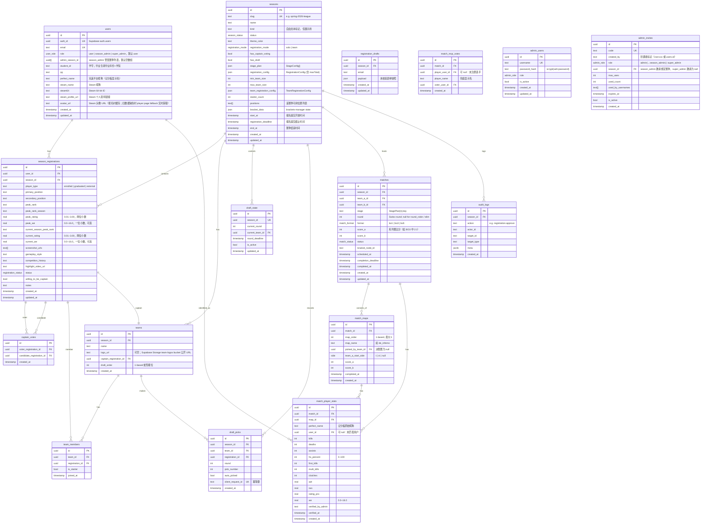

# 数据模型

## ER 图（Mermaid）

---

## 枚举值

### `season.kind`（自由文本，非枚举）

`kind` 是自由文本字段，部署者可自定义任意值（如 "联赛"、"杯赛"、"表演赛"、"league" 等）。

> ⚠️ `kind` 仅用于界面展示和筛选，业务逻辑不得读取此字段做功能分支。所有功能门控读 capability 字段（`hasDraft`、`hasCaptainVoting` 等）。

### `user_role`
| 值 | 说明 |
|---|---|
| `user` | 普通选手（默认） |
| `season_admin` | 赛季管理员（通过邀请码提权，管辖赛季由 `adminSeasonIds` 控制） |
| `super_admin` | 超级管理员（通过邀请码提权，管理所有赛季） |

### `registration_mode`
| 值 | 说明 |
|---|---|
| `solo` | 个人报名 |
| `team` | 队伍整体报名 |

### `season_status`
| 值 | 说明 |
|---|---|
| `draft` | 未发布 |
| `registration` | 报名开放中 |
| `voting` | 队长投票阶段 |
| `drafting` | 蛇形选秀进行中 |
| `playing` | 正赛进行中 |
| `finished` | 赛季已结束 |
| `archived` | 历史归档 |

### `position`（赛季可配置，非固定枚举）

位置列表存储在 `seasons.positions` 数组列中，每个赛季可自定义。默认值为 CS2 五位置：

| 值 | 游戏内名称 |
|---|---|
| `igl` | 指挥（IGL） |
| `awper` | 狙击手（AWPer） |
| `opener` | 突破手（Opener） |
| `closer` | 自由人/残局（Closer） |
| `anchor` | 主防（Anchor） |

报名时 Server Action 从 `season.positions` 读取合法值做动态校验。

### `registration_status`
| 值 | 说明 |
|---|---|
| `pending` | 待审核 |
| `approved` | 已通过 |
| `rejected` | 已拒绝 |
| `waitlisted` | 等待名单 |

### `admin_role`
| 值 | 说明 |
|---|---|
| `super_admin` | 超级管理员（可管理其他管理员） |
| `admin` | 普通管理员（审核报名等日常操作） |

### `match_status`
| 值 | 说明 |
|---|---|
| `scheduled` | 已排期 |
| `in_progress` | 进行中 |
| `finished` | 已结束 |
| `cancelled` | 已取消 |

### `matches.completion_deadline`
管理员可为每场未结束比赛设置“最晚完成时间”。队长时间协商截止时间由应用层计算为：

`time_confirmation_cutoff = completion_deadline - 24 hours`

截止后队长不能再提议、接受或拒绝时间，管理员仍可强制指定 `scheduled_at` 作为运营兜底。`scheduled_at` 不允许晚于 `completion_deadline`。

### `matches.stage`
`matches.stage` 是文本字段，存 `StagePlan[n].key`，不存展示名。Rivals 默认继续使用：

| 值 | 说明 |
|---|---|
| `qualifier` | 排位赛 |
| `playoff` | 正赛（双败淘汰） |

### `match_format`
| 值 | 说明 |
|---|---|
| `bo1` | 一局定胜负，主要用于排位赛 |
| `bo3` | 三局两胜，正赛大部分轮次 |
| `bo5` | 五局三胜，仅总决赛 |

### `stagePlan`
`seasons.stage_plan` 是 `StageConfig[]` JSON，按顺序描述赛事阶段：

| 字段 | 说明 |
|---|---|
| `key` | 稳定业务标识，写入 `matches.stage` |
| `name` | 展示名，可改名 / i18n |
| `type` | `round_robin` / `double_elim` / `single_elim` / `swiss` |
| `teamCount` | 当前阶段队伍数 |
| `advance` | 晋级队伍数 |
| `seeds` | Swiss 预留种子配置 |

> 业务代码读 capability 字段和 `stagePlan`，不读 `season.kind` 做功能分支。

### `side`
| 值 | 说明 |
|---|---|
| `t` | 进攻方（恐怖分子） |
| `ct` | 防守方（反恐精英） |

---

## 唯一约束 & 关键索引

| 表 | 约束 |
|---|---|
| `users` | `UNIQUE(email)`, `UNIQUE(auth_id)` |
| `seasons` | `UNIQUE(slug)` |
| `registration_drafts` | `UNIQUE(season_id, email)` |
| `season_registrations` | `UNIQUE(user_id, season_id)` |
| `captain_votes` | `UNIQUE(voter_registration_id, candidate_registration_id)` |
| `draft_state` | `UNIQUE(season_id)` |
| `draft_picks` | `UNIQUE(client_request_id)` |
| `match_maps` | `UNIQUE(match_id, map_order)` |
| `admin_users` | `UNIQUE(username)` |
| `admin_invites` | `UNIQUE(code)` |
| `match_player_stats` | `UNIQUE(map_id, perfect_name)` |
| `match_mvp_votes` | `UNIQUE(match_id, voter_user_id)` |

建议索引（`drizzle-kit` 迁移中添加）：
- `season_registrations(season_id, status)` — 审核列表过滤
- `season_registrations(season_id, primary_position)` — 位置计数
- `registration_drafts(season_id, email)` — 草稿找回
- `captain_votes(candidate_registration_id)` — 票数聚合
- `draft_picks(season_id, round, pick_number)` — 选秀顺序查询
- `matches(season_id, status)` — 赛程过滤
- `match_time_proposals(match_id, status)` — 时间协商查询
- `match_rosters(match_id)` — 名单查询
- `match_roster_players(roster_id)` — 名单成员查询

---

## Phase 2 新增表（Sub-project 2）

### `match_time_proposals` — 比赛时间协商
| 列 | 类型 | 说明 |
|---|---|---|
| `id` | uuid PK | |
| `match_id` | uuid FK → matches.id | 关联比赛 |
| `proposed_by` | uuid FK → users.id | 提议队长 |
| `force_assigned_by` | uuid FK → users.id | 管理员强制指定（nullable） |
| `status` | text | pending / accepted / rejected / expired |
| `proposed_time` | timestamptz | 提议的比赛时间 |
| `response_at` | timestamptz | 回应时间 |
| `reject_reason` | text | 拒绝原因（≤200 字） |

### `match_rosters` + `match_roster_players` — 赛前名单提交
| 表 | 列 | 类型 | 说明 |
|---|---|---|---|
| `match_rosters` | `id` | uuid PK | |
| | `match_id` | uuid FK → matches.id UNIQUE | 每场比赛一条记录 |
| | `submitted_by` | uuid FK → users.id | 提交队长 |
| | `status` | text | submitted / unlocked |
| | `locked_at` | timestamptz | 提交锁定时间 |
| `match_roster_players` | `roster_id` | uuid FK → match_rosters.id CASCADE | |
| | `team_member_id` | uuid FK → team_members.id | |
| | `is_starter` | boolean | true = 首发（5人），false = 替补（≤2人） |
| | PK | unique(roster_id, team_member_id) | |

---

## 强制约束（来自规则书）

1. 每个主选位置上限 15 人（应用层 Server Action 校验，不用 DB 触发器）。
2. 总报名人数上限 56 人（`registrationConfig.maxTotal`，应用层校验）。
3. 每位选手每届赛事只能投 3 票（应用层计数校验）。
4. 每队同主选位置不超过 2 人（选秀 pick 时 Server Action 校验）。
5. 选秀共 6 轮，每队选 6 人（队长本人 + 6 pick = 7 人）。
6. 时间字段统一 UTC 存储，`Asia/Shanghai` 展示。
